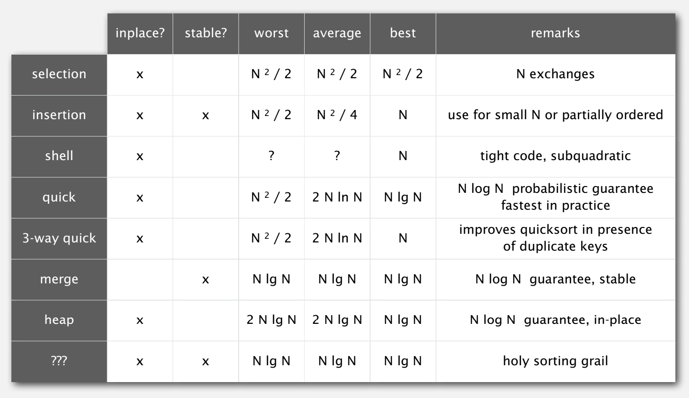

# Sorting Algorithms

<!-- GFM-TOC -->
* [`comparator` in C++](#`comparator` in C++)
* [Bubble Sort](#Bubble Sort)
* [Selection Sort](#Selection Sort)
* [Insertion Sort](#Insertion Sort)
* [Shell Sort](#Shell Sort)
* [Merge Sort](#Merge Sort)
* [Quick Sort](#Quick Sort)
* [Heap Sort](#Heap Sort)
<!-- GFM-TOC -->


## `comparator` in C++
Define **comparator** for **struct Interval**: 

```
sort(intervals.begin(), intervals.end(), **[](Interval &a, Interval &b) {return a.start < b.start;}**);
```
----

> All sorting algorithms below are to make the input array in *numerial ascending order*.

## Bubble Sort
- Main idea:
	- Easiest sorting method
	- each itertation move the minmum element of the unordered part to the end of the ordered part, i.e, in the ith iteration, move the ith minmum element to the ith element in the array
- Time Complexity: O(n^2)
- Space Complexity: O(1)
- [CPP Script](src/bubble_sort.cpp)	

## Selection Sort
- Main idea: 
	- each itertation traverse the unordered part and select the global minimum in 
	- put it at the end of the ordered part or in the ith iteration, swap the ith element and the minimum one
	- perform above until the last element
- Steps:
	- move the pointer to the right
	- indentify index of minimun entry on right
	- exchange into positon
- Time Complexity: O(n^2)
- Space Complexity: O(1)
- [CPP Script](src/select_sort.cpp)

## Insertion Sort
- Main idea: 
	- in the ith iteration, swap the ith element and each one larger than it in the left side, i.e., to make the left i elements in order
- Steps:
	- Move the pointer to the right.
	- Moving from right to left, exchange `a[i]` with each larger entry to its left.
- Time Complexity: O(n^2)
- Space Complexity: O(1)
- [CPP Script](src/insert_sort.cpp)


## Shell Sort
- Main idea: 
	- move entries more than one position at a time by h-sorting the array, i,e., the insertion sort in step h.- the ascending sequence usually is `3x+1`：1, 4, 13, 40, 121, 364...
- Time Complexity (worst): O(n^(3/2))
- Time Complexity (best): O(n)
- Space Complexity: O(1)
- [CPP Script](src/shell_sort.cpp)


## Merge Sort (Bottom-up)
- Main idea: 
	- first split the array into ordered part (minimum case is only one element)
	- then merge two sorted array into the final sorted array
Steps:
	- Divide array into two halves.
	- **Recursively** sort each half.
	- Merge two halves.
- Time Complexity: O(nlog(n))
- Space Complexity: O(n)
- [CPP Script](src/merge_sort.cpp)


## Quick Sort (Divide-and-Conquer Method)
- Main idea:
	- Shuffle the array.
	- Partition(切分) so that, for some j
		- entry a[j] is in place
		- no larger entry to the left of j
		- no smaller entry to the right of j
	- Sort each piece recursively.
- Steps:
	- 选择基准项(pivot element, 一般取第一个元素为pivot)
	- 把数组里所有小于pivot的移动到pivot左边, 大于pivot的移动到右边 ⇒ 此时pivot已经位于最终排序时的正确位置
	- 对pivot左右两个数组分别递归进行快速排序
- Time Complexity: O(nlog(n))
- Space Complexity: O(1)
- [CPP Script](src/quick_sort.cpp) or [CPP Script](src/quick_sort1.cpp)


## Heap Sort
- Main idea:
	- Create max-heap with all N keys.
	- Repeatedly remove the maximum key.
- Steps:
	- 1. Build a max heap from the input data.
	- 2. At this point, the largest item is stored at the root of the heap. Replace it with the last item of the heap followed by reducing the size of heap by 1. Finally, heapify the root of tree.
	- 3. Repeat above steps while size of heap is greater than 1
- Time Complexity: O(nlog(n))
- Space Complexity: O(1)
- [CPP Script](src/heap_sort.cpp) 

## Radix sort

## Bucket sort

# Summary
The table below is referring to [Algorithms, Part I](https://www.coursera.org/learn/introduction-to-algorithms).
<!-- |           | inplace? | stable? |  worst  | average |  best  |   remarks    |
| :-----:   | :-----:  | :-----: | :-----: | :-----: | :-----:|   :-----:    |
| Selection |    X     |         | O(n^2/2)| O(n^2/2)|O(n^2/2)| N exchanges  | -->




## Stable Sorting？
**Stable Sorting** means that the implementation preserves the input order of equal elements in the sorted order。

Stable ones:
- insertion sort
- selection sort
- merge sort

Unstable ones:
- quick sort
- shell sort
- heap sort


## Inplace？
All inplace except **merge sort**.


# References:
1. [排序和搜索](http://wdxtub.com/interview/14520597162931.html)
2. [几种常见排序算法](http://brianway.github.io/2016/05/08/algorithms-several-sort-algorithms)
3. [程序员面试秘籍 第九章 排序](https://github.com/zhuyaguang/kill-interview-part-2/tree/master/程序员面试秘籍%20第九章%20排序)
4. [链表排序（冒泡、选择、插入、快排、归并、希尔、堆排序）](http://www.cnblogs.com/TenosDoIt/p/3666585.html)
5. [quick sort and more: 快速排序算法总结 ](http://x-wei.github.io/quick-sort-and-more.html)
6. [白话经典算法系列之六 快速排序 快速搞定](https://blog.csdn.net/morewindows/article/details/6684558)